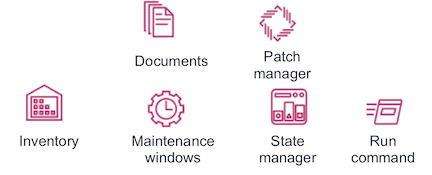

#  Working with AWS Systems Manager

Hello, this is a self-paced workshop designed to explore the main features inside AWS Systems Manager.

## Modules

This workshop is broken up into multiple modules and you can use **N. Virginia, Ohio, Oregon** or **California** Region.
The module 1 **Preparing the environment and Inventory** is required before proceeding to the next:

1\. [Preparing the environment and Inventory](tutorials/preparing-the-environment-and-inventory.md "Preparing the environment and Inventory")

2\. [Resource Groups for Production and Development services](tutorials/resource-groups-for-production-and-development-services.md "Resource Groups for Production and Development services")

3\. [Inventory for Production and Development instances](tutorials/inventory-for-production-and-development-instances.md "Inventory for Production and Development instances")

4\. [Update the SSM Agent with State Manager](tutorials/update-the-ssm-agent-with-state-manager.md "Update the SSM Agent with State Manager")

5\. [Enabling a WebServer in Linux and Windows using a Document and Run Command](tutorials/enabling-a-webserver-in-linux-and-windows-using-a-document-and-run-command.md "Enabling a WebServer in Linux and Windows using a Document and Run Command")

6\. [Patching Linux and Windows with Maintenance Windows](tutorials/patching-linux-and-windows-with-maintenance-windows.md "Patching Linux and Windows with Maintenance Windows")