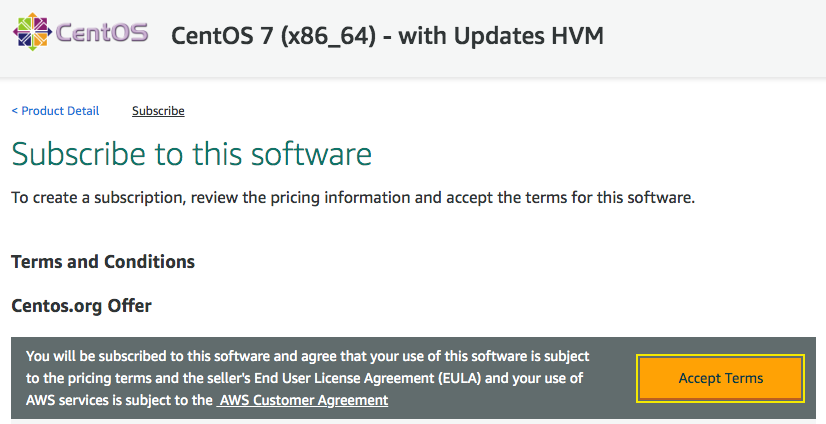
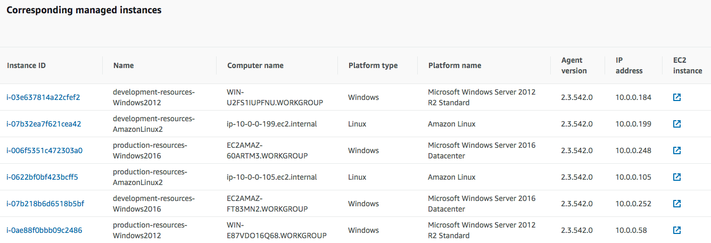
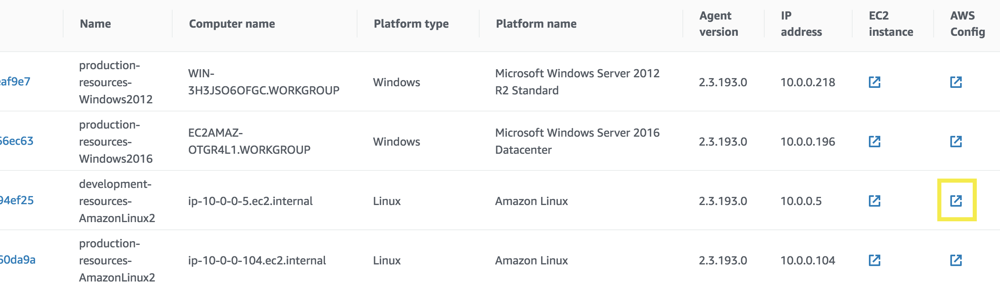
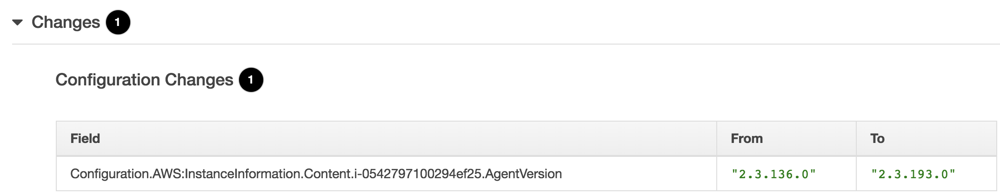
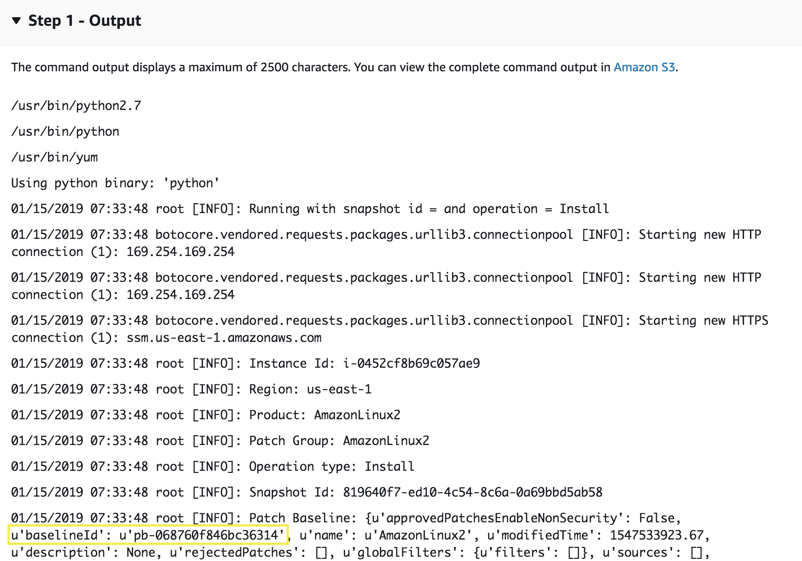

# AWS Systems Manager

Hello, this is a self-paced workshop designed to explore the main features inside AWS Systems Manager.

### Table of Contents
**[Preparing the environment](#preparing-the-environment)** 
**[nventory of Systems Manager](#inventory-of-systems-manager)** 
**[Resource Groups for Production and Development services](#resource-groups)** 
**[Inventory for Production and Development instances](#inventory)** 
**[Update the SSM Agent with State Manager](#state-manager)** 
**[Enabling a WebServer in Linux and Windows using a Document and Run Command](#document-and-run-command)** 
**[Patching Linux and Windows with Maintenance Windows](#patching-and-maintenance-windows)** 

## Preparing the environment

1.1\. Log into the AWS Management Console and choose the preferred [AWS region](http://docs.aws.amazon.com/AWSEC2/latest/UserGuide/using-regions-availability-zones.html).

1.2\. [We need to set up AWS Config to record configuration changes of our resources.](https://docs.aws.amazon.com/config/latest/developerguide/gs-console.html)

1.3\. [We need to create a Keypair to log in to the ec2 instances.](https://docs.aws.amazon.com/AWSEC2/latest/UserGuide/ec2-key-pairs.html#having-ec2-create-your-key-pair)

1.4\. Go to the AWS Marketplace for Centos 9 https://aws.amazon.com/marketplace/pp/B00O7WM7QW?qid=1554065489734, choose **Continue to Subscribe** and choose **Accept Terms**.

1.5\. Launch the [CloudFormation template](AURBAC-AWS-Instances-For-SSM.yaml) two times for your selected region, the first one for the **production** environment and the second one for the **development** environment.

  a\. Open the AWS CloudFormation console at https://console.aws.amazon.com/cloudformation
  
  b\. If this is a new AWS CloudFormation account, click **Create New Stack**. Otherwise, click **Create Stack**.

  c\. In the **Select Template** section, select **Upload a template to Amazon S3** and choose your template downloaded **AURBAC-AWS-Instances-For-SSM.yaml** and click **Next**.

  d\. In the **Specify Details** section, for **Name** type `production-resources` or `development-resources` to identify the cloudformation stacks.

  e\. Select your **KeyPair** created previously, click **Next**.

  f\. For the **Options**, add the tag key `Environment` and the value `Production` or `Development` depending on the stack to be created, click **Next**.

  g\. Check the box `I acknowledge that AWS CloudFormation might create IAM resources.` and click **Create**.

1.6\. Launch the [CloudFormation template](AURBAC-AWS-SSM-Requirements.yaml) to create the S3 bucket and the role for the maintenance window task.

  a\. Open the AWS CloudFormation console at https://console.aws.amazon.com/cloudformation
  
  b\. If this is a new AWS CloudFormation account, click **Create New Stack**. Otherwise, click **Create Stack**.

  c\. In the **Select Template** section, select **Upload a template to Amazon S3** and choose your template downloaded **AURBAC-AWS-SSM-Requirements.yaml** and click **Next**.

  d\. In the **Specify Details** section, for **Name** type `ssm-requirements` to identify the cloudformation stack.

  e\. Click **Next**.

  f\. For the **Options**, click **Next**.

  g\. Check the box `I acknowledge that AWS CloudFormation might create IAM resources.` and click **Create**.

### AWS Services created

* Two amazon VPC environments with two public subnets, each one with:
  * EC2 instance Amazon Linux 2 (t2.micro) with IAM Role and Tags (Environment and Patch Group).
  * EC2 instance Centos 7 (t2.micro) with IAM Role and Tag (Environment).
  * EC2 instance Windows 2012 (t2.medium) with IAM Role and Tag (Environment).
  * EC2 instance Windows 2016 (t2.medium) with IAM Role and Tag (Environment).
  * Each instance has an IAM Role with the policy required for AWS Systems Manager: **AmazonEC2RoleforSSM**
* An S3 bucket for the maintenance window task.
* An IAM Role for the maintenance window task.
* An S3 bucket for session manager.

## Inventory of Systems Manager

As the instances have de SSM Agent installed and the IAM permissions required to be accessed by Systems Manager, you can go to Systems Manager service and click on **Inventory** under Insights section, scroll down and you will see your instances added as follow:

## Resource Groups for Production and Development services

3.1\. Go to Systems Manager service and click on **Find Resources** under Resource Groups section.

3.2\. In **Grouping criteria** apply a filter using the tag key `Environment` and the value `Production` or `Development` and click **View query results**.

3.3\. You will see the resources related to the environment, click on **Save query as group** and name the group as `Production-Services` or `Development-Services` and **Create group**.

In **Saved Resource Groups** under Resource Groups section you will see the resources groups created to explore.

## Inventory for Production and Development instances

4.1\. Go to Systems Manager service and click on **Inventory** under Insights section.

4.2\. Click on **Setup Inventory**.

4.3\. Use the name `Inventory-Association-For-Production` or `Inventory-Association-For-Development`.

4.4\. In Targets section click on **Specifying a tag** and use the tag key `Environment` and the value `Production` or `Development` and click **Setup Inventory**.

4.5\. Click on **State Manager** under Actions section, you will see the Associations created to collect the information for every environment and the Last execution.

**NOTE:** Aditionally, you can create an inventory that search for **Files** or the **Windows Registry**, [example configuration in the Configuring Collection section in step 6](https://docs.aws.amazon.com/systems-manager/latest/userguide/sysman-inventory-configuring.html).

## Update the SSM Agent with State Manager

5.1\. Go to Systems Manager service and click on **State Manager** under Actions section and click on **Create association** button.

5.2\. Use the name `UpdateSSMAgent`.

5.3\. In the Command Document, click in the search bar and select, **Document name prefix**, then click on **Equal**, then type in `AWS-UpdateSSMAgent` and enter.

5.4\. Now select the **AWS-UpdateSSMAgent** document name that will upgrade Systems Management agent on the instances.

5.5\. On Targets, select **Selecting all managed instances in this account**.

5.6\. Specify schedule for **Every Day** at your preference time.

5.7\. Scroll down and click **Create association**.

#### AWS Config: Configuration change

a\. Once the status for **UpdateSSMAgent** association is **Success** go to **Inventory** under Insights section, scroll down and on Corresponding managed instances and click in the AWS Config button for the `development-resources-AmazonLinux2` instance.

b\. In the next page you will see a timeline changes for the instance, the last change will be selected, scroll down and expand the **Changes** section to see the change version for the SSM Agent, you will see something similar like the following:

## Enabling a WebServer in Linux and Windows using a Document and Run Command

### Documents

6.1\. Go to Systems Manager service and click on **Documents** under Shared Resources section and click on **Create document** button.

6.2\. Use the name `ActivateWebServer` for the new document.

6.3\. On Document type select **Command document** and content **JSON** type.

6.4\. Copy and replace in the field text for **Content** with the follwing following structure:

    {
    "schemaVersion": "2.2",
    "description": "Enabling a WebServer.",
    "parameters": {},
    "mainSteps": [
        {
        "action": "aws:runPowerShellScript",
        "precondition": {
            "StringEquals": [
            "platformType",
            "Windows"
            ]
        },
        "name": "WindowsWebServer",
        "inputs": {
            "runCommand": [
                "Set-ExecutionPolicy Unrestricted -Force",
                "New-Item -ItemType directory -Path 'C:\temp'",
                "Import-Module ServerManager",
                "install-windowsfeature web-server, web-webserver -IncludeAllSubFeature",
                "install-windowsfeature web-mgmt-tools"
            ]
        }
        },
        {
        "action": "aws:runShellScript",
        "precondition": {
            "StringEquals": [
            "platformType",
            "Linux"
            ]
        },
        "name": "LinuxWebServer",
        "inputs": {
            "runCommand": [
            "#!/bin/bash",
            "sudo yum update -y",
            "sudo yum install httpd -y",
            "sudo systemctl enable httpd",
            "sudo systemctl start httpd"
            ]
        }
        }
    ]
    }

6.5\. Scroll down and click **Create document**.

### Run Command

6.6\. Go to Systems Manager service and click on **Run Command** under Actions section and click on **Run Command** button.

6.7\. On the Run a command page, click in the search bar and select, **Owner**, then click on **Owned by me**.

6.8\. Now select the **ActivateWebServer** document name that we created previously.

6.9\. For the command paramters we are going to use the default values, where Password is referenced for the Paramater Store created.

6.10\. On Targets, select **Specifying a tag** and apply a filter using the tag key `Environment` and the value `Development`, click on **Add**.

6.11\. Scroll down and click **Run**.

6.12\. Next you will see page documenting your running command then and overall success in green.

**Once each instance task is finished you can check the web server by accessing by the public IP in your browser.**

## Patching Linux and Windows with Maintenance Windows

We are going to create a special PatchBaseline that will only apply to Amazon Linux 2 instances based on the tag **Patch Group**, for rest of the instances will be applied the default Patch Baselines provided by AWS.

### Patch Baseline

7.1\. Go to Systems Manager service and click on **Patch Manager** under Actions section and click on **Create Maintenance Window** button.

7.2\. Use the name `AmazonLinux2`.

7.3\. For the **Operating system** select `Amazon Linux 2`.

7.4\. For aproval rules leave the configuration for **All** or be specific in the clasification and severity.

7.5\. Click on **Create patch baseline**.

7.6\. Refesh the page until you can see the new patch baseline, select it and click on **Actions** and **Modify patch groups**.

7.7\. In the **Patch groups** field type `AmazonLinux2` and click on **Add**.

7.8\. Click in **Close**.

**Remember that this new patch baseline will only apply to instances tagged with "Patch Group" and the value of "AmazonLinux2".**

### Maintenance Windows

7.9\. Go to Systems Manager service and click on **Maintenance Windows** under Actions section, click on **Create maintenance window**.

7.10\. Use the name `MaitenanceWindowForDevelopmentInstances`.

7.11\. Schedule the maitenance for every day at the desired time.

7.12\. Specify a duration of `2` and stop initiating tasks of `1`.

7.13\. You can select your **Schedule timezone** prefered.

7.14\. Click on **Create maintenance window**.

7.15\. To configure the targets click on the maintenance window created, go to **Targets** and click on **Register target**.

7.16\. For the **Target Name** type `DevelopmentInstances`.

7.17\. In Targets, select **Specifying tags** and in Tags type the key `Environment` and the value of `Development`.

7.18\. Click on **Register target**.

7.19\. Now go to **Tasks** of the maintenance window and click on **Register tasks** and **Register Run command task**.

7.20\. For the **Name** type `DevelopmentInstances`.

7.21\. In the Command Document, click in the search bar and select, **Document name prefix**, then click on **Equal**, then type in `AWS-RunPatchBaseline` and enter.

7.22\. Now select the **AWS-RunPatchBaseline** document name that will apply the patches depending of the operating systen and Patch Group tag.

7.23\. In Targets select the target created **DevelopmentInstances**.

7.24\. Use a **Concurrency** of `10` and an **Error threshold** of `1`.

7.25\. For the **IAM service role** select **Use a custom service role** and select `ssm-requirements-RoleMaintenanceWindowTask-XXXXXXXXXXXXX`, it correspond to the output value of **ArnRoleMaintenanceWindowTask** from the **ssm-requirements** cloudformation stack.

7.26\. For the **Output options** check **Enable writing to S3** and type output value of **BucketMaintenanceWindowTaskOutput** from the **ssm-requirements** cloudformation stack.

7.27\. In Parameters, for the **Operation** select **Install**.

7.28\. Click on **Register Run command task**.

**For testing purpose, you can edit the Maitenance Window to be executed in a nearby time, and go to History and refresh the page until you can see the task in progress and completed, explore the details and outputs to verify the patch baseline applied. Also you can go to Run Command and you will see command executed for the AWS-RunPatchBaseline.**

For example, in the following image you can see the patch baseline applied for the Amazon Linux 2 instance, it should correspond to the patch baseline id created to be applied to instances with the tag **Patch Group** and value of **AmazonLinux2**.
