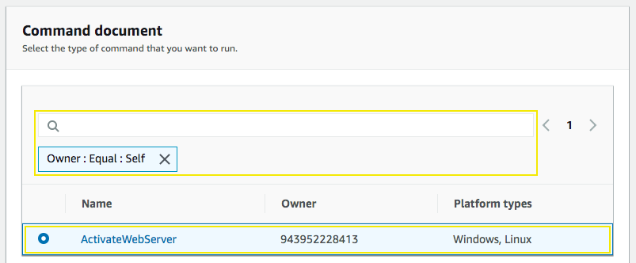
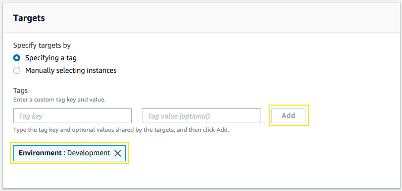
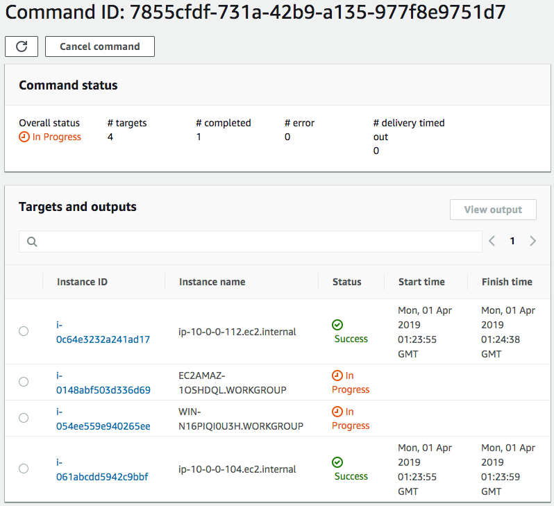

# Enabling a WebServer in Linux and Windows using a Document and Run Command

## 1. Create a Document

1.1\. Go to Systems Manager console on the **Documents** page https://console.aws.amazon.com/systems-manager/documents and click on **Create document** button.

1.2\. In Document Details for the **Name** type `ActivateWebServer`.

1.3\. On Document type select **Command document** and content **JSON** type.

1.4\. Copy and replace in the field text for **Content** with the follwing following structure:

``` json
    {
    "schemaVersion": "2.2",
    "description": "Enabling a WebServer.",
    "parameters": {},
    "mainSteps": [
        {
        "action": "aws:runPowerShellScript",
        "precondition": {
            "StringEquals": [
            "platformType",
            "Windows"
            ]
        },
        "name": "WindowsWebServer",
        "inputs": {
            "runCommand": [
                "Set-ExecutionPolicy Unrestricted -Force",
                "New-Item -ItemType directory -Path 'C:\temp'",
                "Import-Module ServerManager",
                "install-windowsfeature web-server, web-webserver -IncludeAllSubFeature",
                "install-windowsfeature web-mgmt-tools"
            ]
        }
        },
        {
        "action": "aws:runShellScript",
        "precondition": {
            "StringEquals": [
            "platformType",
            "Linux"
            ]
        },
        "name": "LinuxWebServer",
        "inputs": {
            "runCommand": [
            "#!/bin/bash",
            "sudo yum update -y",
            "sudo yum install httpd -y",
            "sudo systemctl enable httpd",
            "sudo systemctl start httpd"
            ]
        }
        }
    ]
    }
```

1.5\. Scroll down and click **Create document**.

## 2. Run Command

2.1\. Go to Systems Manager console on the **Run Command** page https://console.aws.amazon.com/systems-manager/run-command and click on **Run Command** button.

2.2\. On the Run a command page, click in the search bar and select, **Owner**, then click on **Owned by me**.

2.3\. Now select the **ActivateWebServer** document name that we created previously.



2.4\. On **Targets**, select **Specifying a tag** and add a filter using the tag key `Environment` and the value `Development`, click on **Add**.



2.5\. Scroll down and click **Run**.

2.6\. Next you will see page documenting your running command then and overall success in green.



**Note:** Once each instance task is finished you can check the web server by accessing by the public IP in your browser.