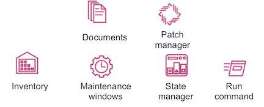

#  Working with AWS Systems Manager

Hello, this is a self-paced workshop designed to explore the main features inside AWS Systems Manager.

## AWS Account Required

In order to complete these workshops you'll need a valid active AWS Account with Admin permissions. Use a personal account or create a new AWS account to ensure you have the neccessary access. This should not be an AWS account from the company you work for.

**If the resources that you use for this workshop are left undeleted you will incur charges on your AWS account.**

You can use **N. Virginia, Ohio, Oregon** or **California** Region.
The module 1 **Preparing the environment and Inventory** is required before proceeding to the next.