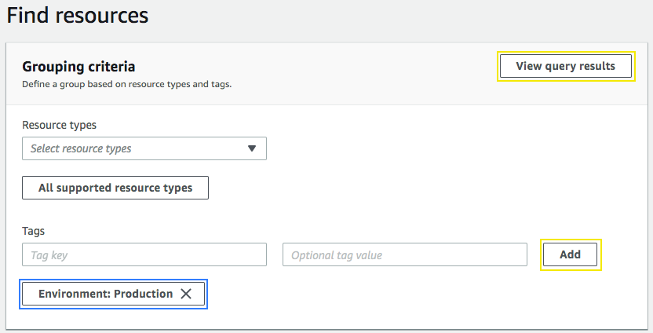
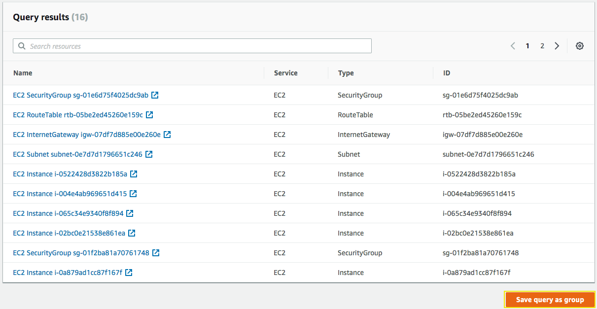
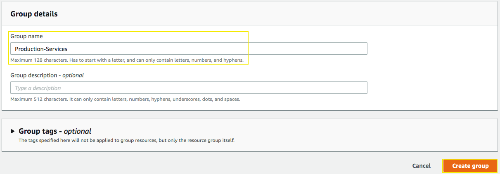
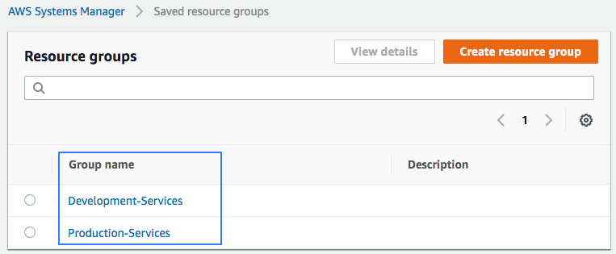

# Resource Groups for Production and Development services

## 1. Create Resource Groups

We are going to create two resource groups, for **production** and **development** services.

1.1\. Go to Systems Manager console on the **Find Resources** page https://console.aws.amazon.com/resource-groups/resources.

1.2\. In **Grouping criteria** add a filter using the Tag key `Environment` and the value `Production` or `Development` and click **View query results**.

1.3\. Scroll down, you will see the resources related to the environment, click on **Save query as group**.

1.4\. Scroll down and for the **Group Name** type `Production-Services` or `Development-Services` and **Create group**.

1.5\. Go to Systems Manager console on the **Saved Resource Groups** page https://console.aws.amazon.com/resource-groups/groups you will see the resources groups created to explore.

