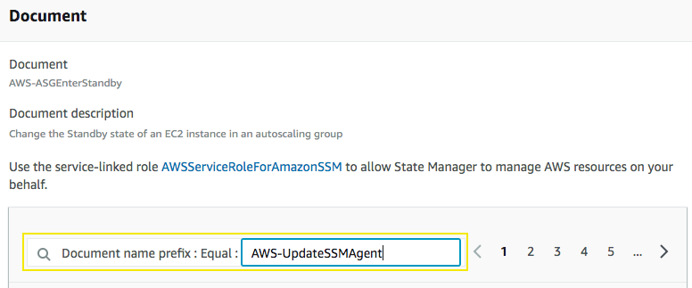
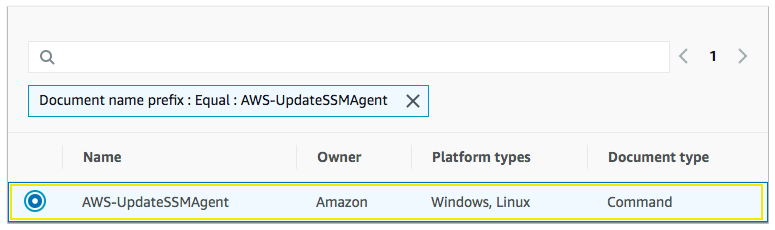
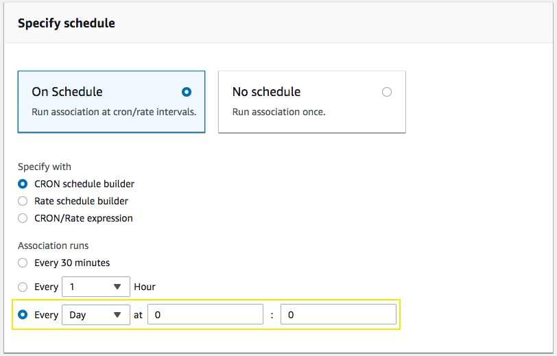
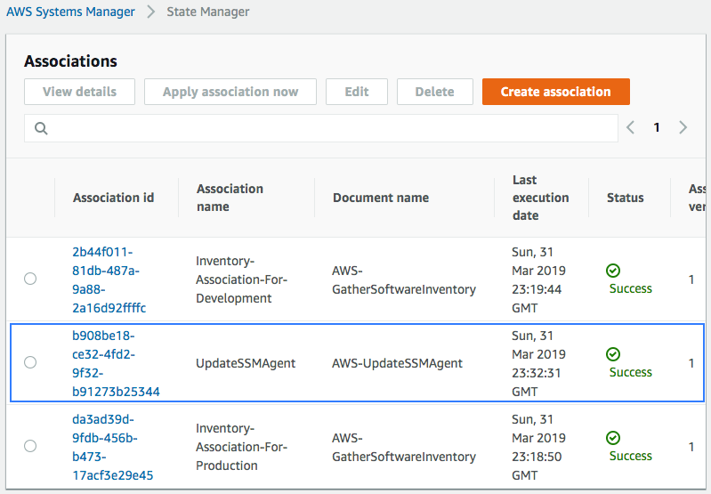
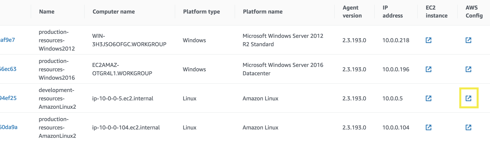
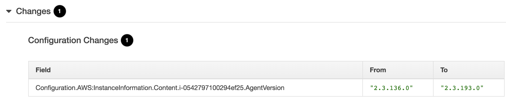

# Update the SSM Agent with State Manager

## 1. Create Association

1.1\. Go to Systems Manager console on **State Manager** page https://console.aws.amazon.com/systems-manager/state-manager and click on **Create association** button.

1.2\. For the **Name** type `UpdateSSMAgent`.

1.3\. In the Command Document, click in the search bar and select, **Document name prefix**, then click on **Equal**, then type in `AWS-UpdateSSMAgent` and enter.

1.4\. Now select the **AWS-UpdateSSMAgent** document name that will upgrade Systems Management agent on the instances.

1.5\. On Targets, select **Selecting all managed instances in this region under this account**.

1.6\. Specify schedule for **Every Day** at your preference time.

1.7\. Scroll down and click **Create association**.

## 2. AWS Config: Configuration change

a\. Once the status for **UpdateSSMAgent** association is **Success** go to **Inventory** under Insights section, scroll down and on Corresponding managed instances and click in the AWS Config button for the **development-resources-AmazonLinux2** instance.

b\. In the next page you will see a timeline changes for the instance, the last change will be selected, scroll down and expand the **Changes** section to see the change version for the SSM Agent, you will see something similar like the following:

