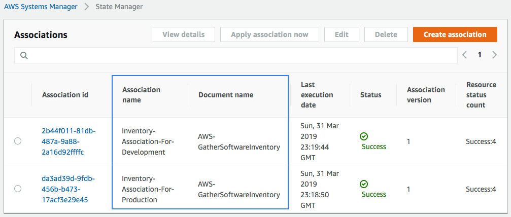
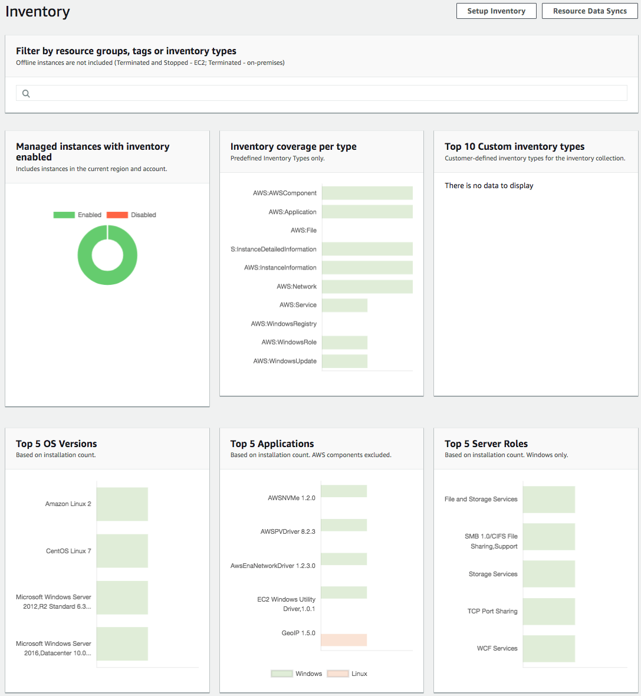

# Inventory for Production and Development instances

## 1. Setup Inventory

We are going to setup up two associations, for **production** and **development** instances.

1.1\. Go to Systems Manager console on the **Inventory** page https://console.aws.amazon.com/systems-manager/inventory.

1.2\. Click on **Setup Inventory**.

1.3\. Use the name `Inventory-Association-For-Production` or `Inventory-Association-For-Development`.

1.4\. In **Targets** section click on **Specifying a tag** and use the tag key `Environment` and the value `Production` or `Development` and click **Setup Inventory**.

1.5\. Go to **State Manager** page https://console.aws.amazon.com/systems-manager/state-manager, you will see the Associations created to collect the information for every environment and the Last execution.

1.6\. You can go to Systems Manager **Inventory** https://console.aws.amazon.com/systems-manager/inventory and see more details.

**NOTE:** Aditionally, you can create an inventory that search for **Files** or the **Windows Registry**, [example configuration in the Configuring Collection section in step 6](https://docs.aws.amazon.com/systems-manager/latest/userguide/sysman-inventory-configuring.html).