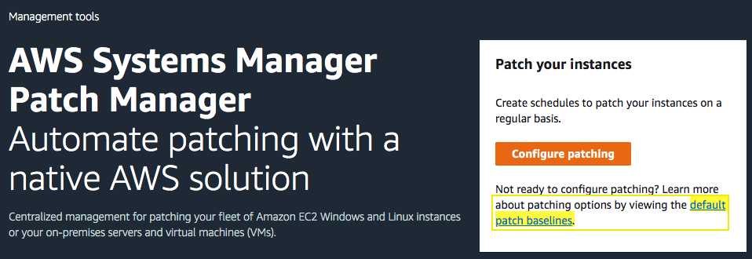
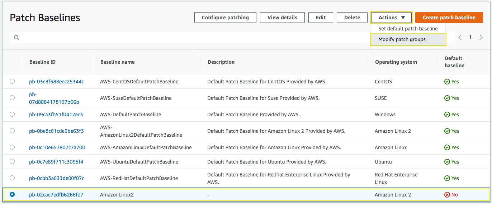
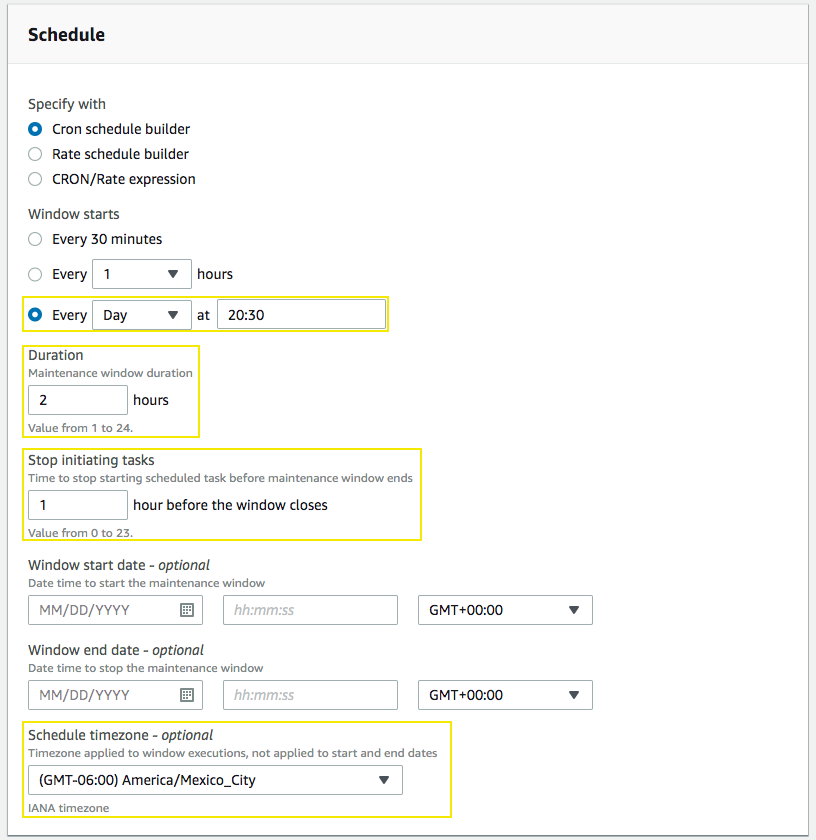
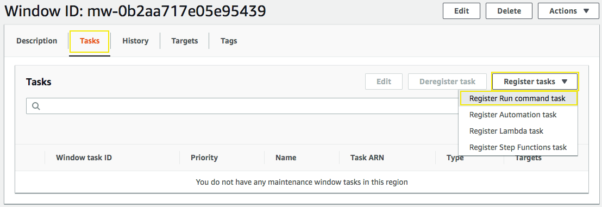
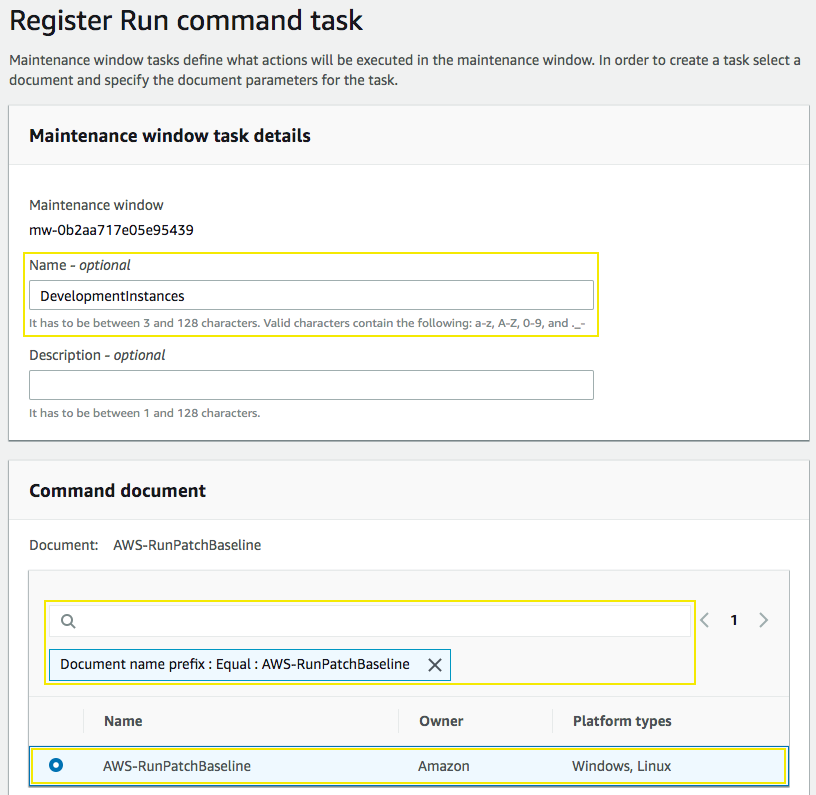
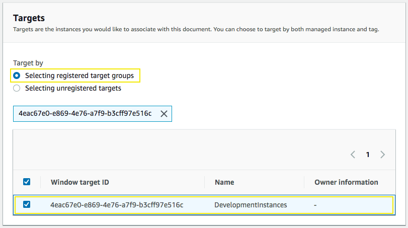
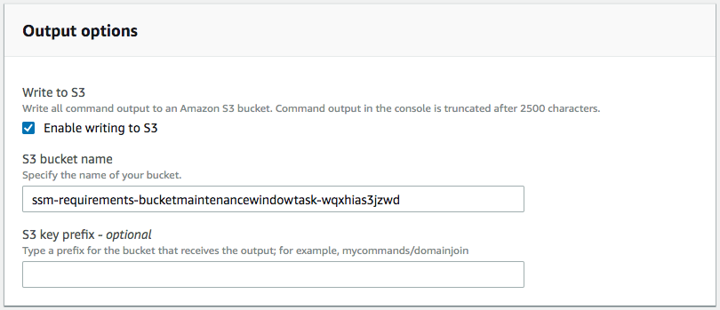
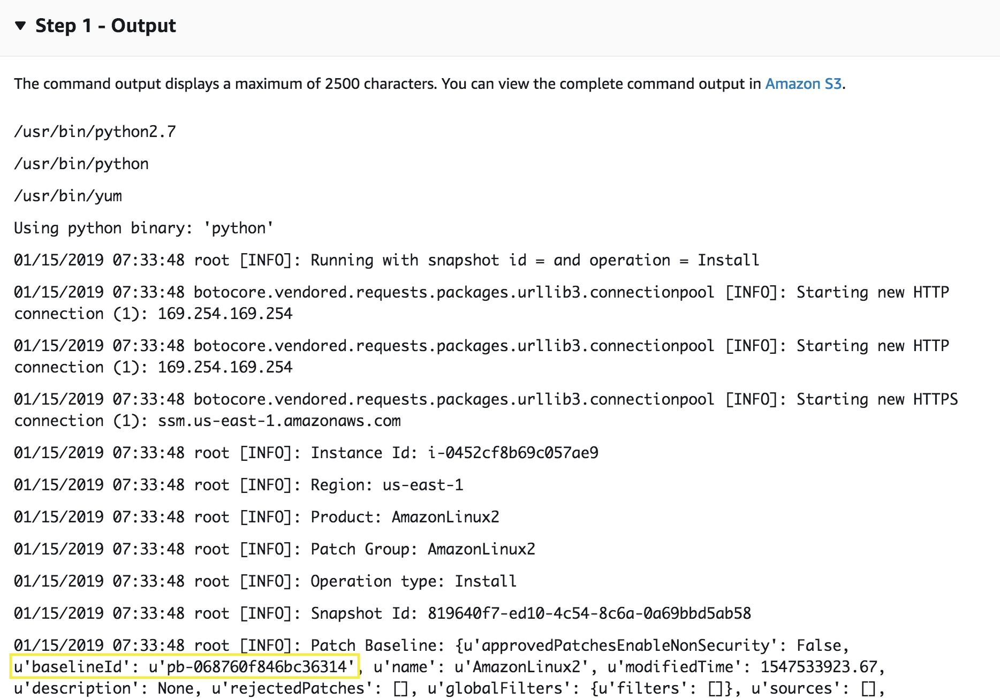

# Patching Linux and Windows with Maintenance Windows

We are going to create a special PatchBaseline that will only apply to Amazon Linux 2 instances based on the tag **Patch Group**, for rest of the instances will be applied the default Patch Baselines provided by AWS.

## 1. Patch Baseline

1.1\. Go to Systems Manager console on the **Patch Manager** page https://console.aws.amazon.com/systems-manager/patch-manager and click on **default patch baselines** link.

1.2\. Choose **Create patch baseline**.

1.3\. For the **Name** type `AmazonLinux2`.

1.4\. For the **Operating system** select `Amazon Linux 2`.

1.5\. For **Aproval rules for operating systems** leave the configuration for **All** or be specific in the clasification and severity.

1.6\. Click on **Create patch baseline**.

1.7\. Refesh the page until you can see the new patch baseline, select it and click on **Actions** and **Modify patch groups**.

1.8\. In the **Patch groups** field type `AmazonLinux2` and click on **Add**.

1.9\. Click in **Close**.

**Note:** Remember that this new patch baseline will only apply to instances tagged with the key **Patch Group** and the value of **AmazonLinux2**, the instances **production-resources-AmazonLinux2** and **development-resources-AmazonLinux2** already have the tags required.

## 2. Maintenance Windows

2.1\. Go to Systems Manager console on **Maintenance Windows** page https://console.aws.amazon.com/systems-manager/maintenance-windows and click on **Create Maintenance Window**.

2.2\. For the **Name** type `MaitenanceWindowForDevelopmentInstances`.

2.3\. Schedule the maitenance for every day at the desired time, prefered 5 minutes ahead of your current time.

2.4\. Specify a duration of `2` and stop initiating tasks of `1`.

2.5\. You can select your **Schedule timezone** prefered.

2.6\. Click on **Create maintenance window**.

2.7\. To configure the targets click on your maintenance Window ID, go to **Targets** and click on **Register target**.

2.8\. For the **Target Name** type `DevelopmentInstances`.

2.9\. In Targets, select **Specifying tags** and in Tags type the key `Environment` and the value of `Development`.

2.10\. Click on **Register target**.

2.11\. Now go to **Tasks** of the maintenance window and click on **Register tasks** and **Register Run command task**.

2.12\. For the **Name** type `DevelopmentInstances`.

2.13\. In the **Command document** section click in the search bar and select, **Document name prefix**, then click on **Equal**, then type in `AWS-RunPatchBaseline` and enter.

2.14\. Now select the **AWS-RunPatchBaseline** document name that will apply the patches depending of the operating systen and Patch Group tag.

2.15\. In Targets select the target created **DevelopmentInstances**.

2.16\. In **Rate control** use a **Concurrency** of `10` and an **Error threshold** of `1`.

2.17\. For the **IAM service role** select **Use a custom service role** and select `ssm-requirements-RoleMaintenanceWindowTask-XXXXXXXX`, it correspond to the output value of **ArnRoleMaintenanceWindowTask** from the **ssm-requirements** cloudformation stack.

2.18\. For the **Output options** check **Enable writing to S3** and type output value of **BucketMaintenanceWindowTaskOutput** from the **ssm-requirements** cloudformation stack.

2.19\. In **Parameters**, for the **Operation** select **Install**.

2.20\. Click on **Register Run command task**.

**Note:** For testing purpose, you can edit the Maitenance Window to be executed in a nearby time.

2.21\. Go to **History** tab and refresh the page until you can see the task in progress and completed, explore the details and outputs to verify the patch baseline applied, select your Window execution ID and click on **View details**, select your task invocation ID and click on **View details**.

**Note:** Also you can go to Run Command and you will see command executed for the AWS-RunPatchBaseline.

For example, in the following image you can see the patch baseline applied for the Amazon Linux 2 instance, it should correspond to the patch baseline id created to be applied to instances with the tag **Patch Group** and value of **AmazonLinux2**.
