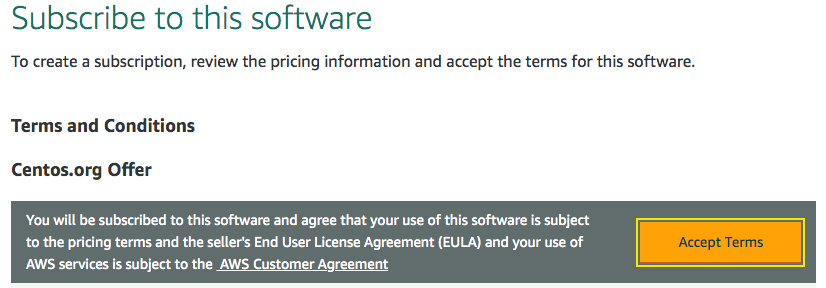
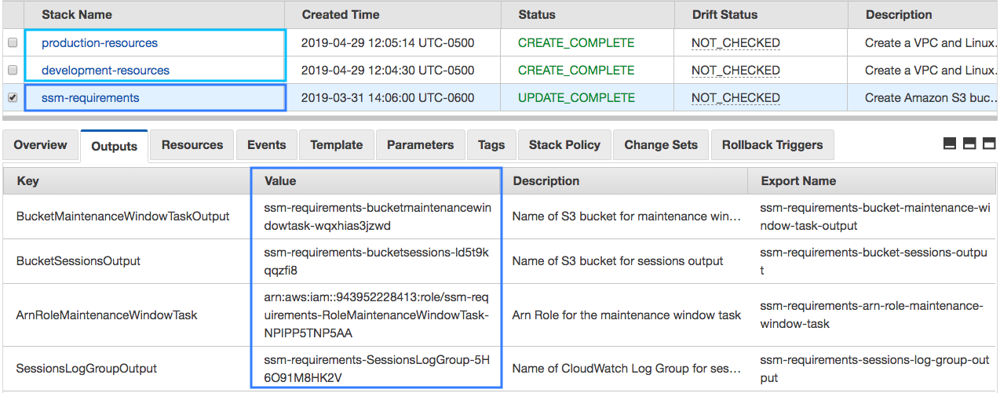
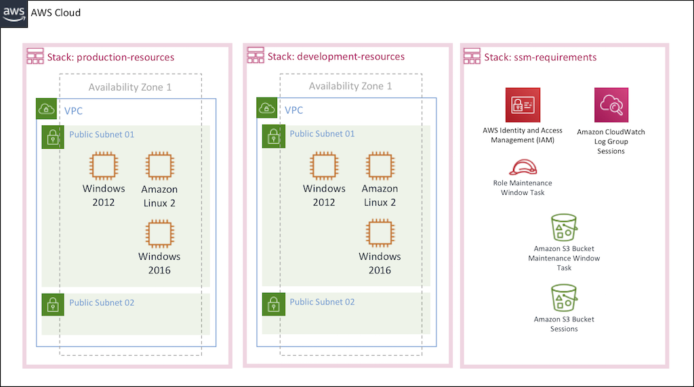

# Preparing the environment and Inventory

## 1. Creating the AWS Services

1.1\. Log into the AWS Management Console and choose the [N. Virginia, Ohio, Oregon or California Region](http://docs.aws.amazon.com/AWSEC2/latest/UserGuide/using-regions-availability-zones.html), for the rest of the modules remember to use the same region.

1.2\. [Set up AWS Config to record configuration changes of our resources.](https://docs.aws.amazon.com/config/latest/developerguide/gs-console.html)

1.3\. [Create a Keypair to log in to the EC2 instances.](https://docs.aws.amazon.com/AWSEC2/latest/UserGuide/ec2-key-pairs.html#having-ec2-create-your-key-pair)

1.4\. Go to the AWS Marketplace for CentOS 7 https://aws.amazon.com/marketplace/pp/B00O7WM7QW?qid=1554065489734, choose **Continue to Subscribe** and choose **Accept Terms**.

1.5\. Download the [CloudFormation template AURBAC-AWS-Instances-For-SSM.yaml](../AURBAC-AWS-Instances-For-SSM.yaml), we are going to launch it two times in your selected region, the first one for the **production environment (stack: production-resources)** and the second one for the **development environment (stack: development-resources)**.

  a\. Open the AWS CloudFormation console at https://console.aws.amazon.com/cloudformation.
  
  b\. If this is a new AWS CloudFormation account, click **Create New Stack**. Otherwise, click **Create Stack**.

  c\. In the **Select Template** section, select **Upload a template to Amazon S3** and choose your template downloaded **AURBAC-AWS-Instances-For-SSM.yaml** and click **Next**.

  d\. In the **Specify Details** section, for **Name** type `production-resources` or `development-resources` to identify the cloudformation stacks.

  e\. Select your **KeyPair** created previously, click **Next**.

  f\. For the **Options**, add the tag key `Environment` and the value `Production` or `Development` depending on the stack to be created, click **Next**.

  g\. Check the box `I acknowledge that AWS CloudFormation might create IAM resources.` and click **Create**.

1.6\. Download the [CloudFormation template AURBAC-AWS-SSM-Requirements.yaml](../AURBAC-AWS-SSM-Requirements.yaml) and launch to create the Amazon S3 buckets, CloudWatch Log Group and the IAM Role for the maintenance window task.

  a\. Open the AWS CloudFormation console at https://console.aws.amazon.com/cloudformation
  
  b\. If this is a new AWS CloudFormation account, click **Create New Stack**. Otherwise, click **Create Stack**.

  c\. In the **Select Template** section, select **Upload a template to Amazon S3** and choose your template downloaded **AURBAC-AWS-SSM-Requirements.yaml** and click **Next**.

  d\. In the **Specify Details** section, for **Name** type `ssm-requirements` to identify the cloudformation stack.

  e\. Click **Next**.

  f\. For the **Options**, click **Next**.

  g\. Check the box `I acknowledge that AWS CloudFormation might create IAM resources.` and click **Create**.

1.7\. Now you have two CloudFormation stacks with the services required as follows, for the **ssm-requirements** stack you will see some values in **Outputs** required further.

## 2. AWS Services created

* Two amazon VPC environments with two public subnets, each one with:
  * EC2 instance Amazon Linux 2 (t2.micro) with IAM Role and Tags (Environment and Patch Group).
  * EC2 instance Centos 7 (t2.micro) with IAM Role and Tag (Environment).
  * EC2 instance Windows 2012 (t2.medium) with IAM Role and Tag (Environment).
  * EC2 instance Windows 2016 (t2.medium) with IAM Role and Tag (Environment).
  * Each instance has an IAM Role with the policy required for AWS Systems Manager: **AmazonEC2RoleforSSM**
* An Amazon S3 bucket for the maintenance window task.
* An IAM Role for the maintenance window task.
* An Amazon S3 bucket for session manager.
* A CloudWatch Log Group for session manager.

## 3. Inventory of Systems Manager

As the instances have de SSM Agent installed and the IAM permissions required to be accessed by Systems Manager, you can go to Systems Manager **Inventory** https://console.aws.amazon.com/systems-manager/inventory.
Scroll down and you will see your instances added as follow:

